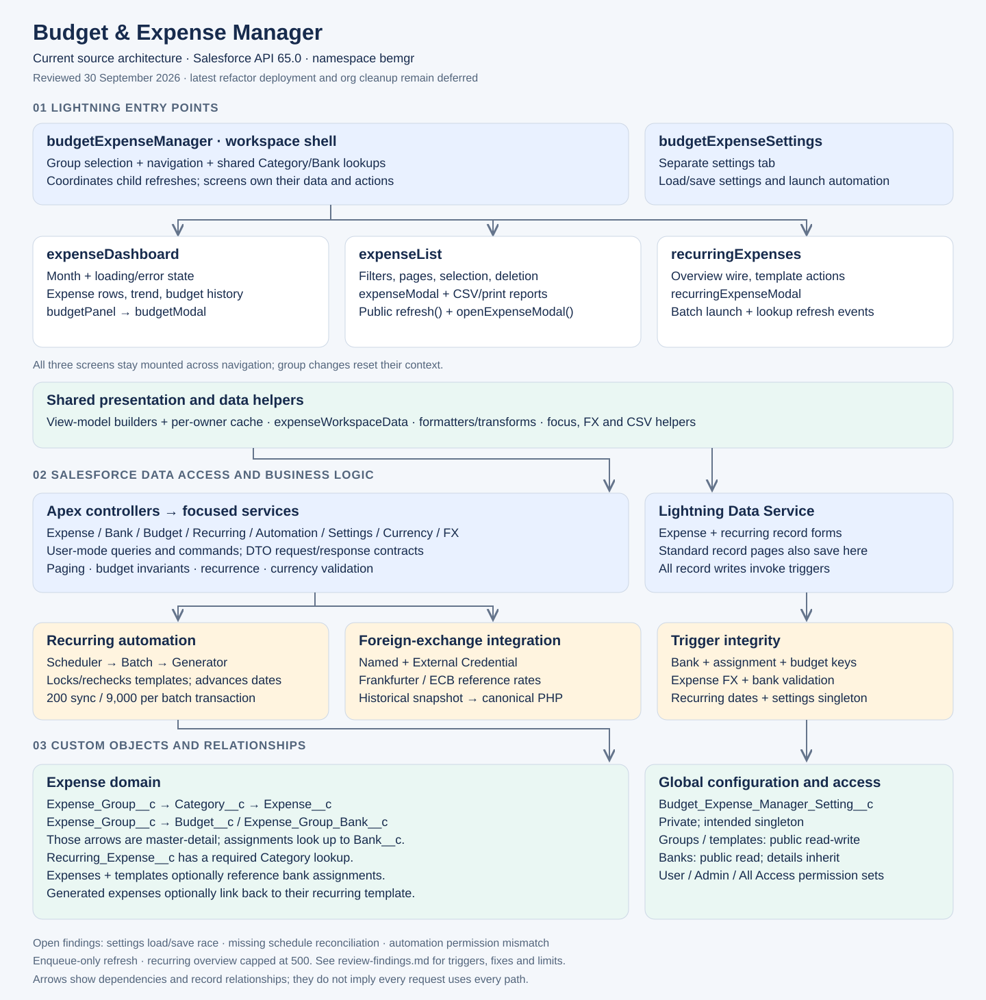

# Architecture

Source reviewed on 2026-09-30. This document describes the current checkout, not a verified live-org inventory. The screen-ownership refactors and cleanup have been pushed; deploying those changes and removing retired org metadata remain deferred.



## Runtime Boundaries

This is a Salesforce-native app: LWC screens call Apex or Lightning Data Service, Salesforce custom objects store records, and triggers enforce write invariants. Frankfurter is the optional external exchange-rate provider; there is no separate application server or external database.

| Owner | Responsibility |
| --- | --- |
| `budgetExpenseManager` | Expense Group selection, navigation/sidebar, group/category wires, shared bank options, and cross-screen refresh coordination |
| `expenseDashboard` | Selected month, dashboard/trend/budget-history requests, loading/errors, and dashboard view model |
| `expenseList` | Filters/search, pagination, selection, deletion/rollback, expense modal state, and CSV/print workflows |
| `recurringExpenses` | Overview wire and refresh, template state, recurring modal, deactivation, and batch launch |
| `budgetExpenseSettings` | Separate settings tab, configuration load/save, scheduler status, and manual run action |

The three workspace screens stay mounted across navigation, preserving local state and pending work. Group changes reset their context. The expense modal is outside the expense screen's hidden section so Dashboard can open it without navigating away. Dashboard emits `addexpense` and `viewexpenses`; the list emits `expenseschanged`; recurring emits `generationstarted`. The manager routes these events and refreshes sibling screens through their public `refresh()` methods. Shared lookup refresh/retry requests return to the manager. Generation-start refresh is currently enqueue-time, not completion-time (see open findings below).

`expenseWorkspaceData` wraps imperative reads and report pagination. Each screen owns its request guards and applies results only for its current context; the manager guards its shared lookups. Pure `expenseDashboardViewModel`, `expenseListViewModel`, and `recurringExpenseViewModel` builders derive presentation data. `expenseWorkspaceViewModels` memoizes only dashboard/list view models. Expense and recurring dialogs save through Lightning Data Service record forms; `budgetPanel` performs budget mutations through Apex.

## Data Model

```text
Expense_Group__c
  -> Budget__c (optional monthly master-detail child)
       - Budget_Month__c (normalized to first day)
       - Amount__c
       - Description__c (optional)
       - Budget_Key__c (generated unique group/month key)
  -> Expense_Group_Bank__c (Bank assignment; master-detail child)
       - Bank__c (required restricted lookup to the global Bank record)
       - Active__c
       - Expense_Group_Bank_Key__c (generated unique group/bank key)
       - Supported_Credit_Card__c, Supported_Debit_Card__c
       - Supported_Bank_Payment__c, Supported_Bank_Transfer__c
  -> Category__c (Expense_Group__c master-detail)
       - Display_Name__c
       - Total_Amount__c (roll-up, read-only)
       -> Expense__c (Category__c master-detail, reparentable)
            - Amount__c (canonical PHP amount)
            - Original_Amount__c (optional foreign amount)
            - Original_Currency_Code__c (optional ISO code)
            - Exchange_Rate_To_PHP__c (optional PHP per original unit)
            - Exchange_Rate_Date__c (optional effective date)
            - Exchange_Rate_Source__c (optional provider/manual attribution)
            - Expense_Date__c
            - Transaction_Time__c (optional)
            - Bank_Assignment__c (optional restricted lookup during migration)
            - Bank__c (temporary legacy global-value-set fallback)
            - Transaction_Type__c (picklist)
            - Description__c
            - Recurring_Expense__c (lookup, optional)

Recurring_Expense__c
  -> Category__c (required lookup)
       - Amount__c
       - Bank_Assignment__c (optional restricted lookup during migration)
       - Bank__c (temporary legacy global-value-set fallback)
       - Transaction_Type__c
       - Description__c
       - Frequency__c (Daily, Weekly, Monthly, Yearly)
       - Start_Date__c
       - End_Date__c
       - Next_Run_Date__c
       - Active__c

Bank__c (global, Public Read Only catalog)
  - Name
  - Active__c
  - Bank_Key__c (generated normalized unique key)

Budget_Expense_Manager_Setting__c
  - Base_Currency_Code__c (stable ISO reporting currency)
  - Recurring_Expenses_Enabled__c
  - Global_Recurring_Run_Time__c
  - Last_Recurring_Run_DateTime__c
  - Last_Recurring_Run_Status__c
  - Last_Recurring_Run_Message__c

Legacy `Spending__c` metadata has been removed. `Expense_Group__c` is the active top-level object.
```

`Bank__c` stores each institution once. `Expense_Group_Bank__c` is a logical junction with a master-detail relationship to the Expense Group and a deletion-restricted lookup to the global Bank. Its generated composite key prevents duplicate group/Bank assignments. Expense and recurring records reference the assignment so the database retains the selected group context; deleting a referenced assignment or an assigned global Bank is restricted. Deactivation removes a choice from new selections without changing historical labels. During the additive migration, application reads prefer the assignment relationship and fall back to the unchanged legacy picklist.

Payment methods are configured per `Expense_Group_Bank__c`, so two groups can use the same Bank with different transaction types. The four supported-method checkboxes default to enabled for new assignments; existing assignments require initialization during [the staged rollout](bank-payment-methods.md). Cash is available only with no Bank selected and defaults for new Expenses and recurring templates. Both dialogs place Bank before Transaction Type and filter the types to the selected assignment's enabled methods. Changing Bank replaces an unsupported type with the first enabled method; assignments with no enabled methods require another Bank or No bank. Clearing Bank sets Cash. Trigger validation also enforces supported methods for new or changed selections, while preserving unchanged historical types and the legacy Bank fallback. Disable or change active recurring templates before disabling a method they use, so generation is not stranded by a configuration change.

`Budget__c` is opt-in by record presence. A group/month with no budget record keeps the original expense-only behavior. `BudgetTrigger` normalizes the month and regenerates the unique group/month key for every insert and update, so only one budget can exist for that context. Removing a budget does not remove or change expenses. The standard `Budget__c` tab provides list-view and record-level administration alongside the Dashboard budget panel.

Foreign-currency data is also opt-in by record presence. When every FX field is blank, `ExpenseCurrencyService` leaves the existing PHP amount untouched. When any FX field is present, the service requires a complete snapshot, normalizes its currency/source text, rejects invalid dates and amounts, and recalculates `Amount__c` with half-up rounding in the before trigger. This keeps imports, standard record pages, API writes, and the custom modal on the same database invariant. Historical rates are never refreshed automatically. The user may request an ECB reference estimate through Frankfurter or enter a settled rate manually; the response date and source are stored with the Expense.

Recurring expenses are managed as templates. The generator Apex creates due
`Expense__c` records, links them back through `Expense__c.Recurring_Expense__c`,
sets `Expense__c.Transaction_Time__c` to the user-local time of generation, then
advances the template's `Next_Run_Date__c`.
Monthly and yearly recurrence calculations use `Start_Date__c` as the anchor.
If the target day does not exist in a later month, the generator uses that
month's last day without permanently shifting the anchor.
`Next_Run_Date__c` is the system pointer. `RecurringExpenseTrigger` defaults it
from `Start_Date__c` when a template is created and keeps it aligned with
`Start_Date__c` until the pointer has advanced. Generation remains catch-up based:
each occurrence from the pointer through the run date is created, bounded by
`End_Date__c`. If the transaction cap is reached, the first ungenerated occurrence
is persisted so the next run resumes without replay. Templates whose pointer is
after their End Date remain visible but are neither due nor processed, and the
trigger rejects an End Date before the Start Date. Reactivation and frequency edits
preserve an already-advanced pointer; changing that policy is a separate product decision.
The synchronous selector first applies user-mode access and the batch retains its sharing
boundary. Generation then inserts the system-managed recurring link and advances a sparse
`Next_Run_Date__c` record in system mode because both fields are intentionally read-only in
the app permission sets; trigger validation still runs for both DML operations.
The workspace Add/Edit path is the non-exposed `recurringExpenseModal`. It uses
`lightning-record-edit-form` for mutation, UI API for current record context, and the
group-scoped Category and Bank selectors owned by `budgetExpenseManager`. The modal never
submits `Next_Run_Date__c`; it displays the value as read-only guidance. The manager retains
the cacheable Category wire result; `recurringExpenses` owns the recurring-overview wire result,
modal state, and template-save refresh. Both owners use `refreshApex()` for their own wire. Bank options use a non-cacheable imperative request
with group and request-token guards so every modal open receives fresh assignments without a
stale response replacing newer state. Imperative expense, Dashboard, trend, and Bank-option
reads are grouped behind the non-visual `expenseWorkspaceData` boundary. The expense list and
dashboard own their data request tokens; the manager owns shared Bank lookup tokens.
`Budget_Expense_Manager_Setting__c` is a singleton app settings object. `BudgetExpenseSettingsTrigger`
prevents more than one settings record. The settings service creates the default
record when it is missing and initializes a blank base currency exactly once from Salesforce.
Validation rules require a normalized three-letter code and prevent the initialized value from
being changed or cleared through UI, API, or import paths.
`CurrencyContextController` exposes only the sanitized, persisted currency through a read-only
cacheable method; initialization remains on the non-cacheable admin settings path. Single-currency
orgs use their organization default, while multi-currency orgs resolve the corporate currency
through a dynamic `CurrencyType` query so the source still compiles when that object is unavailable.
The current PHP-specific FX and display layers are unchanged until the next currency workstream.
Recurring automation currently uses these global
settings; `Expense_Group__c` has no group-specific settings fields.

Lightning calls enter Apex only through classes under `classes/controller`. Their request and
response contracts are top-level, data-only classes under `classes/dto`. Keep simple endpoint-specific
queries in their controllers: `ExpenseController` owns Expense Group and Category lookups, and
`BankController` owns Bank option queries and mapping. Extract services when they isolate substantial
business logic or actual reuse, rather than requiring a layer for every endpoint. Preserve sharing,
user-mode SOQL, permissions, and public contracts when consolidating. The UI keeps `"All"` as a combobox-only value
and translates it to `null`, while Apex group/category contracts use `Id`. Batch and scheduled
entry points live under `classes/async` without changing their Salesforce metadata names.

## Apex Methods

- `ExpenseController.getAllExpenseGroups()` - cacheable user-mode lookup returning the bounded workspace list ordered by Name.
- `BankController.getAvailableExpenseGroupBanks(expenseGroupId)` - non-cacheable, returns fresh active global Banks assigned to the requested accessible Expense Group; modal loads are request-guarded to ignore stale responses.
- `BankController` owns user-mode group-scoped Bank assignment lookup and option mapping directly.
- `BudgetController.getMonthlyBudget(expenseGroupId, budgetMonth)` - cacheable, normalizes the month and returns the optional group budget or `null`.
- `BudgetController.getBudgetHistory(expenseGroupId, endMonth)` - cacheable, returns the accessible budgets in the bounded six-month window ending in the requested month.
- `BudgetController.saveMonthlyBudget(request)` - creates or updates the single budget for a group/month using user-mode DML.
- `BudgetController.deleteMonthlyBudget(budgetId)` - removes the accessible budget record without affecting expenses.
- `BudgetService` - owns user-mode budget queries, validation, mutations, lookup normalization, and Lightning-safe responses; `BudgetSaveRequest` is data-only.
- `CurrencyContextController.getCurrencyContext()` - cacheable read-only façade returning the pinned base currency and the current Salesforce multi-currency feature state.
- `CurrencyContextService` and `SalesforceOrganizationCurrencyProvider` - validate the stored ISO code, cache it per transaction, and resolve the organization or corporate currency only for first-time settings initialization.
- `ExchangeRateController.getPhpRate(request)` - returns a validated PHP-per-unit quote through the public `Exchange_Rates_API` Named Credential; null dates use today and future dates are rejected.
- `ExchangeRateService` and `FrankfurterExchangeRateProvider` - validate ISO-style source codes, pin the request to the ECB provider, accept recent prior business-day observations, reject stale or malformed responses, and return sanitized errors with a manual-rate fallback.
- `ExpenseCurrencyService` - bulk-safe before-trigger authority for optional FX completeness, normalization, date validation, and canonical PHP calculation.
- `ExpenseController.getCategoriesByExpenseGroup(expenseGroupId)` - cacheable user-mode lookup; a null ID returns the bounded compatibility list.
- `ExpenseController.getExpensesByFilters(filters)` - delegates dynamic user-mode querying to `ExpenseQueryService`; filter DTO group/category values are `Id` or null.
- `ExpenseController.getExpensePage(filters, pagination)` - delegates keyset pagination and full-filter first-page totals to `ExpensePageService`; `ExpensePageRequest` and `ExpensePageDto` hold the paging contract.
- `ExpenseController.getMonthlyTrend(filters)` - delegates monthly aggregation to `ExpenseQueryService`.
- `ExpenseController.deleteExpenses(expenseIds)` - delegates bulk user-mode deletion to `ExpenseCommandService`.
- `ExpenseController.deleteExpense(expenseId)` - delegates the null check and scoped user-mode deletion to `ExpenseCommandService`.
- `RecurringExpenseController.getRecurringExpenseOverview(expenseGroupId)` - first recurring-template page with complete group totals. `getRecurringExpensePage(expenseGroupId, cursor, pageSize)` continues the same user-mode keyset query; `deactivateRecurringExpense(recurringExpenseId)` remains the normal-user command entry point.
- `RecurringExpenseAutomationController.generateDueExpenses()` - creates due recurring expenses up to a bulk-safe cap, updates recurrence tracking dates, and returns a top-level generation DTO.
- `RecurringExpenseAutomationController.runDueExpensesBatch()` - Admin/All Access entry point that starts the Batch Apex generator and returns the batch job ID.
- `RecurringExpenseCalculator` - owns recurrence due-date checks and next-run-date calculations for daily, weekly, monthly, and yearly frequencies.
- `RecurringExpenseBatch` - Batch Apex processor for due recurring expenses. Each batch chunk creates expenses and advances `Next_Run_Date__c`.
- `RecurringExpenseScheduler.execute(context)` - scheduled Apex wrapper that starts `RecurringExpenseBatch`.
- `SettingsController.getSettings()` and `saveSettings(request)` - Admin/All Access Lightning entry points for global settings.
- `BudgetExpenseSettingsService` - creates/updates the singleton settings record, initializes its base currency once, and tracks recurring run status without exposing Lightning methods directly.

## Custom Application

`Budget_Expense_Manager.app-meta.xml` supports Small and Large form factors. Its tabs are `Budget_Expense_Manager`, `Expense_Group__c`, `Bank__c`, `Budget__c`, `Expense__c`, `Recurring_Expense__c`, `Category__c`, and `Budget_Expense_Manager_Settings`; its utility bar is `Budget_Expense_Manager_UtilityBar`. The renamed `budgetExpenseManagerLogo` content asset is retained in source but is not currently referenced by the application metadata.

## Permission Sets

Ordinary controller classes use `with sharing` and normal operations enforce user-mode access. Integrity validators sometimes use system-mode reads to prevent inaccessible related records from bypassing invariants. Recurring generation writes the system-managed origin link and next-run pointer in system mode after its selection/locking checks.

The default sharing model is not private per user: Expense Groups and recurring templates are internal Public Read/Write; Banks are internal Public Read; categories, expenses, budgets, and bank assignments are Controlled by Parent; settings are Private. External sharing is Private for the root objects and Controlled by Parent for their master-detail children. Profiles and additional permission assignments can expand access and require separate org inspection.

- `Budget_Expense_Manager_User` - Day-to-day app access. Grants the Bank, Budget, Currency Context, Exchange Rate, Expense, and normal recurring-template controllers, the public exchange-rate credential principal, read-only access to the global Bank catalog, and normal CRUD on group Bank assignments, budgets, expense groups, categories, expenses, and recurring expense templates without `viewAllRecords` or `modifyAllRecords`. The Banks tab is hidden from this permission set; assignments are managed from the Expense Group related list.
- `Budget_Expense_Manager_Admin` - Operational admin access. Grants the normal controllers, including Currency Context and Exchange Rate, plus `SettingsController` and `RecurringExpenseAutomationController`, the public exchange-rate credential principal, full access to global Banks and group assignments, and access to budgets and settings.
- `Budget_Expense_Manager_All_Access` - Development/admin convenience set. Uses the same controller-only Apex access boundary as Admin, grants the public exchange-rate credential principal, and grants broad CRUD plus `viewAllRecords` and `modifyAllRecords` on the app objects. Generated key fields stay hidden.

Admin and All Access currently provide effectively equivalent app capabilities, including broad record access. Normal User excludes settings-object access and the settings/automation controllers. The recurring screen currently still displays its manual run action to that role; this is an open UI capability mismatch, not evidence of granted Apex access.

## Pages And Tabs

- `Budget_Expense_Manager` - LWC custom tab backed directly by `budgetExpenseManager`, which avoids the standard Lightning App Page title strip.
- `Budget_Expense_Manager_Settings` - LWC custom tab backed directly by `budgetExpenseSettings`.
- `Bank__c` - standard Banks tab for Admin/All Access catalog maintenance; group assignments remain contextual on Expense Group records and have no standalone tab.
- `Budget__c` - standard Budgets tab for list-view and record-level administration.
- `Budget_Expense_Manager_UtilityBar` - UtilityBar, left-aligned desktop.
- `Expense_Record_Page` - RecordPage for `Expense__c`, overrides the View action.

## Query And Automation Limits

- Group selection and the null-group compatibility category lookup are bounded at 2,000 records. Group-specific categories are not subject to that same explicit cap.
- Expense listing starts with 20 rows, loads 10 more per request, and debounces search by 300 ms. Keyset ordering uses expense date, transaction time, creation time, and ID; the cursor is checked against the filter scope. Reports fetch all pages in batches of 200, deduplicate IDs, reject looping cursors, and cancel stale requests.
- Dashboard loads matching expense rows without list pagination, alongside monthly aggregates and six-month budget history. Large matching datasets remain a scaling boundary.
- Recurring overview initially loads 50 templates and supports Load more with keyset pagination, ordered by active status, next run date (null last), name, and record ID. Counts and monthly estimates describe all matching templates through separate aggregates. A read-only `Due_For_Generation__c` formula preserves the due rule, including valid ended-schedule catch-up occurrences, for complete due counts.
- Synchronous recurring generation caps output at 200 expenses; each batch transaction caps at 9,000 and processes a scope of 50 templates. Lock/reload and due-date rechecks protect generation, while retained next-run pointers allow catch-up to resume. Batch finish records aggregate results and failed-chunk status; reaching a cap is not clearly reported as unfinished catch-up.

## Open Review Findings

These source-confirmed findings remain unresolved as of 2026-09-30. Documentation updates do not implement their fixes.
See the maintained [review findings](review-findings.md) for follow-up scope and status.

| Finding | Source and intended follow-up |
| --- | --- |
| Normal users see an unauthorized manual-run action | [`recurringExpenses.js`](../force-app/main/default/lwc/recurringExpenses/recurringExpenses.js) exposes the action, while the User permission set omits `RecurringExpenseAutomationController`. Gate the UI on the intended capability. |
| Data refresh can precede batch completion | The recurring screen receives the queued job ID, then emits `generationstarted` and refreshes immediately. Track completion or provide explicit pending status and a refresh action. |

## Source Versus Org State

Recurring pagination and complete summaries are deployed to `mainDevOrg` as of 2026-10-03. Deployment `0AfgK00000VH2I5SAL` passed all 154 repository Apex tests; frontend verification passed 111 Jest tests across eleven suites. See [testing notes](testing-and-tooling.md) for coverage and regression details.

Settings saves now repair missing/unusable schedules when enabled, even with an unchanged time. Valid same-time jobs retain their owner and timezone. This Apex change passed Salesforce check-only validation (19/19 tests, 93.14% service coverage) and awaits deployment; see F2 in [review findings](review-findings.md).

API version is `65.0`; the project namespace is `bemgr` and `force-app` is the default package directory. This does not establish managed-package installation status. Current source has no active Flow implementation or populated Aura bundle. Eight controllers, sixteen service/interface classes, fifteen DTOs, six handlers, six triggers, two async classes, and eighteen Apex test classes implement the backend.

`manifest/package.xml` is the current deployment set. Historical rebrand/destructive manifests are migration records, not an instruction to replay cleanup. Retired lookup selectors/services and presentation bundles have been removed from source; deleting files in Git does not delete their deployed counterparts. Live scheduled jobs, settings records, permission assignments, credential access, and removed metadata must be checked before the deferred deployment and cleanup. The 2026-09-30 source review passed 66 Jest tests in nine suites and lint; that review did not rerun Apex tests or inspect the live org.
